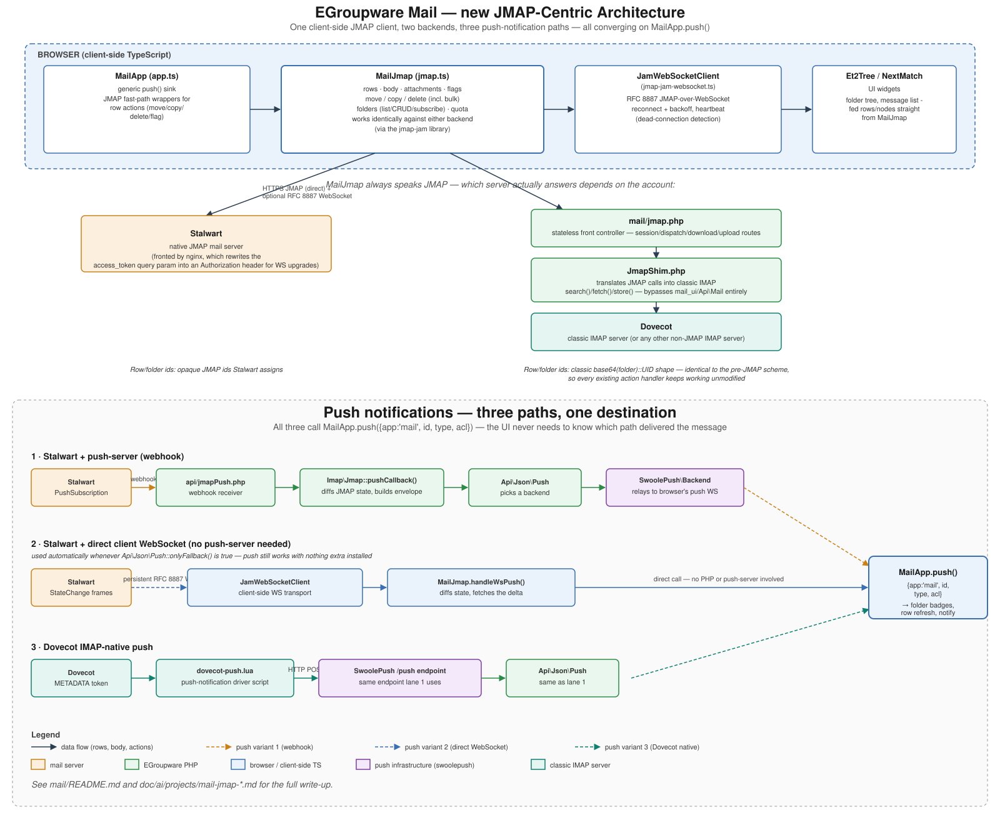

# EGroupware Mail: new JMAP-centric architecture

This document describes the current architecture of the mail app after its migration to a
**JMAP-centric, client-side-first** design. It covers:

- why almost everything that doesn't need admin/privileged access now runs in the browser
- how the same client-side code works against both a native JMAP server (Stalwart) and a
  classic IMAP-only server (Dovecot, via a JMAP shim)
- the three different ways new-mail/flag/folder push notifications reach the browser

## The big picture: client-side first

Historically, every mail list, message body, attachment, flag change, move/copy/delete and
folder operation went through a `mail.mail_ui.ajax_*` round trip: the browser sent an action,
PHP re-opened an IMAP connection, did the work, and sent back HTML or a JSON patch. That model
doesn't scale well and duplicates logic that a JMAP-capable client can just do itself.

The mail app now does almost all of this **directly in the browser**, talking JMAP:

- `mail/js/jmap.ts` (`MailJmap`) fetches rows, message bodies, attachments, changes flags,
  moves/copies/deletes messages (including "select all matching filter" bulk operations),
  manages the folder tree (list/create/rename/move/delete/subscribe) and quota display, and
  handles push notifications - all with **zero PHP round trips** for a native JMAP account, and
  with only very small, focused PHP endpoints for a classic-IMAP account (see below).
- `mail_ui::get_rows()` - the single biggest source of round trips in the old architecture -
  has been **removed entirely**. There is no server-side row-fetch fallback anymore.
- What's left server-side is either (a) genuinely admin/privileged work - `mail_acl.inc.php`
  (ACL editing with admin-impersonation) is deliberately never done client-side - or (b) a thin
  compatibility shim for servers that don't speak JMAP.

See `doc/ai/projects/mail-jmap-modernization.md`, `mail-bo-decoupling.md` and
`mail-folder-tree-jmap.md` for the detailed, method-by-method migration history.

## Two backends, one client

`MailJmap` doesn't know or care whether it's talking to a real JMAP server or not - it always
speaks JMAP (via the [jmap-jam](https://github.com/nnnnat/jmap-jam) library). Which server it
actually reaches is decided once, server-side, per mail account:

| | Native JMAP (Stalwart) | Classic IMAP (Dovecot, ...) |
|---|---|---|
| JMAP session URL | Stalwart's own `.well-known/jmap` endpoint | `mail/jmap.php` (this app) |
| Row/folder ids | Opaque JMAP ids Stalwart assigns | Classic `base64(folder)::UID` shape, so a shimmed row is indistinguishable from the pre-JMAP row-id scheme |
| Who implements the JMAP methods | Stalwart itself | `EGroupware\Mail\JmapShim` (`mail/src/JmapShim.php`) |

### The JMAP shim (`mail/jmap.php` + `mail/src/JmapShim.php`)

For any account whose IMAP server doesn't speak JMAP, `mail/jmap.php` is a small, **stateless**
front controller: it boots EGroupware like any other ajax endpoint, releases the session lock
immediately (it doesn't need it), and routes to `JmapShim`:

- `session()` - returns an RFC 8620 session-discovery document pointing `apiUrl`/`downloadUrl`/
  `uploadUrl` back at itself.
- `dispatch()` - runs a batch of JMAP method calls (`Mailbox/query|get|set`, `Email/query|get|
  set|import`, `Quota/get`), resolving RFC 8620 §3.7 result-references between calls in the same
  batch, exactly like a real JMAP server would.
- `download()`/`upload()` - RFC 8620 §6.2/§6.3 blob transfer.

Crucially, `JmapShim` only implements the handful of JMAP methods `MailJmap` actually sends, and
it talks **directly** to the account's `Horde_Imap_Client_Socket` connection (`search()`/
`fetch()`/`store()`) - it deliberately bypasses `mail_ui`/`Api\Mail` entirely, so it can't
inherit any of that class's session-state assumptions. It authenticates via the normal
EGroupware session cookie; the bearer token handed to the JMAP client library is a fixed dummy
string, never the real session id.

Because the shim reuses the exact classic row-id shape, every existing action handler (move,
delete, flag, ...) keeps working unmodified regardless of which path served the row.

## Push notifications: three variants

All three variants ultimately call the same client-side sink, `MailApp.push(pushData)`
(`mail/js/app.ts`), with the same `{app: 'mail', id, type, acl}` envelope - folder-tree unseen
badges, row refresh and new-mail notifications don't need to know which variant delivered the
message.

### 1. Stalwart + a real push-server (webhook)

Used when a push-server backend (e.g. the `swoolepush` app) is installed and registered via the
`push-backends` hook.

1. `ProfileHandler::jmapBootstrap()` registers a JMAP `PushSubscription` with Stalwart, pointed
   at `api/jmapPush.php`.
2. Stalwart POSTs `StateChange`/`PushVerification` events to that URL.
3. `Api\Mail\Imap\Jmap::pushCallback()` diffs JMAP state, builds the push envelope(s), and hands
   them to `Api\Json\Push`.
4. `Api\Json\Push` dispatches through whatever backend is registered (e.g.
   `EGroupware\SwoolePush\Backend`), which relays to the browser's already-open push websocket.

### 2. Stalwart + a direct client-side WebSocket (no push-server needed)

Used automatically whenever **no** real push-server backend is registered
(`Api\Json\Push::onlyFallback()` is true) - so push still works out of the box even without
installing anything extra.

`mail/js/jmap-jam-websocket.ts` (`JamWebSocketClient`) opens a persistent RFC 8887
JMAP-over-WebSocket connection straight from the browser to Stalwart (with reconnect/backoff and
a heartbeat to detect a connection a NAT/proxy silently dropped). Stalwart pushes `StateChange`
frames over that same connection; `MailJmap.handleWsPush()` diffs state and fetches the delta
exactly like the webhook path does server-side, then calls `MailApp.push()` directly - **no PHP
or push-server involved at all** for this variant.

### 3. Dovecot's own IMAP-native push

Used for plain IMAP accounts. `Api\Mail\Imap::enablePush()` registers a token via IMAP
`METADATA`. A Dovecot push-notification driver script (`push_notification_driver =
lua:file=.../dovecot-push.lua`, shipped with `swoolepush`) reads that token and, on new mail or
flag changes, POSTs a JSON event straight to the instance's push endpoint - the same endpoint
variant 1's webhook fan-out uses - which flows through `Api\Json\Push` to the browser exactly
like variant 1.

## Key files

| File | Role |
|---|---|
| `mail/js/jmap.ts` | `MailJmap` - the JMAP client used against *either* backend: rows, body, attachments, flags, bulk actions, folders, quota, push handling |
| `mail/js/jmap-jam-websocket.ts` | `JamWebSocketClient` - RFC 8887 JMAP-over-WebSocket transport (push variant 2) |
| `mail/js/folderTree.ts` | Builds `Et2Tree` node data from JMAP `Mailbox` objects |
| `mail/js/app.ts` | `MailApp` - app glue, hosts the generic `push()` sink and JMAP-fast-path wrappers for row actions |
| `mail/jmap.php` | HTTP front controller for the JMAP shim |
| `mail/src/JmapShim.php` | The JMAP shim itself - implements JMAP on top of classic IMAP calls |
| `mail/src/Ui/ProfileHandler.php` | Browser bootstrap (`jmapBootstrap()`), push enablement dispatch |
| `api/src/Mail/Imap/Jmap.php` | Stalwart-backed IMAP class; server-to-server JMAP push (`pushCallback()`) |
| `api/src/Mail/Jmap.php` | Generic PHP JMAP *client* library, used server-to-server against Stalwart |
| `api/jmapPush.php` | Webhook receiver for Stalwart's push-server-backed subscriptions (push variant 1) |
| `mail/inc/class.mail_ui.inc.php` | Legacy menuaction-dispatch surface; increasingly a thin delegator to the classes above |

For the full migration history and design decisions behind each piece, see
`doc/ai/projects/mail-jmap-modernization.md`, `mail-bo-decoupling.md`,
`mail-folder-tree-jmap.md` and `mail-jmap-jam-websocket.md`.